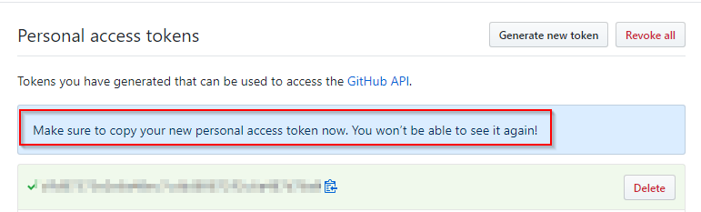

# Github and Databricks Integration
> Sync Databricks notebook revision history to Github

See official Microsoft [documentation](https://docs.microsoft.com/en-us/azure/databricks/notebooks/github-version-control)

## Introduction
Databricks has auto-saving and revision history features built-in which allow a user to easily revert the notebook's code to a previous version im time. 

The Github and Databricks integration allows a user to sync a notebook to a specified repository and file within the repository.

As the user makes changes to their notebook on Databricks, a specific version auto-tracked by Databricks can be committed to the repository and made available exactly as displayed in Databricks, now on Github. 

Databricks notebooks (ie iPython/Jupyter notebooks), are rendered in Github just as they are displayed in Databricks. Having versioned notebooks (code, output, visuals) available on Github can be very powerful when working with changing data sources and code bases. 

## Advantages

**Accessibility**
* Sharing: Notebooks on Github can be accessed and shared securely with others, while allowing read only access for some. This could be useful to share the output of a Notebook without requiring access to Databricks
* Referencing: Github excels at it's ability to search large code bases for a specific piece of code. 
* Communication: Github and the concepts of Git allows for comments to be made on specific pieces of code, and the ability to have highly technical discussions.

**Version Control**
* Collaboration: Having version control allows users to work on the same pieces of code simultaneously, able to reference and integrate others' changes into the codebase through the commit log and change history. 
* Data/Output: Notebooks that output tables, information, and graphs can be versioned at that point in time and saved to Github. This can be useful when trying to diagnose the prior output of a specific model or function of code.
     
## Example Notebook hosted on Github
> https://github.com/maitbayev/the-elements-of-statistical-learning/blob/master/chapter-02/2.3-least-squares-and-nearest-neighbors.ipynb

-------------------------------------------------

## Index
1. [Create Github Access Token](#create-a-new-github-personal-access-token)
2. [Enable Github and Databricks integration](#enable-github-and-databricks-integration)
3. [Create a private repository for your notebooks](#create-a-private-repository-for-your-notebooks)
3. [Link your Databricks Notebook to Github](#link-your-databricks-notebook-to-github)
4. [Commit Notebook revisions to Github](#commit-notebook-revisions-to-github)

## Instructions
### Create a new Github Personal Access Token
1. Generate a new Github "Personal access token" [here](https://github.com/settings/tokens/new)

2. Name the token:`databricks` and select the following scopes: 
* `repo` (select all sub options)
* `gist`

    

3. Scroll to the bottom of the page and click "Generate token"

3. The token will be displayed, copy and paste the token somewhere temporary but secure, you will enter it into Databricks in the next step.

    

### Enable Github and Databricks integration
1. In a new browser tab, navigate to your Databricks instance, login, and click on your user profile icon in the top-right. Click `User Settings`

    

2. Click `Git Integration`, and select `Github` as your Git provider.

    

3.  Paste and save your Github token.

    

### Create a private repository for your notebooks

1. Create a new Github repository [here](https://github.com/new). Be sure that the repository is set to `Private`
    * Repository name: `databricks-notebooks`
    * `Private`: You choose who can seee and commit to this repository
    * `Initialize` this repository with a README
    * Create repository

    

2. Your new Github repository will be available at `https://github.com/{USERNAME}/{REPOSITORY_NAME}`

    

### Link your Databricks notebook to Github
> Every time a new notebook is created it needs to be linked to corresponding file on your Github Repository

1.  Open the notebook to be synced to Github and click `Revision history` >  `Git: Not linked`

    

2.  Link the notebook to a file on Github
    * `Link`: the url of the Github repository ex. Github user: `john` repository: `my-db-notebooks` would be: `https://github.com/john/my-db-notebooks`
    * `Branch`: Defaults to `master`
    * `Path in Git Repo`: The filepath relative to the repository: ex. `notebooks/my_synced_notebook.ipynb` would create a new directory: `notebooks` in the repository and sync the file into that directory. The resulting URL would look like: `https://github.com/john/my-db-notebooks/notebooks/my_synced_notebook.ipynb`
    
    
### Commit notebook revisions to Github

1. Save and commit a revision history to Github
    
    

2. Write a commit description of the changes made in this revision

    

3. Each revision you commit to Github is able to be referenced in Databricks

    
    
    

4. Synced notebooks are available on Github
   